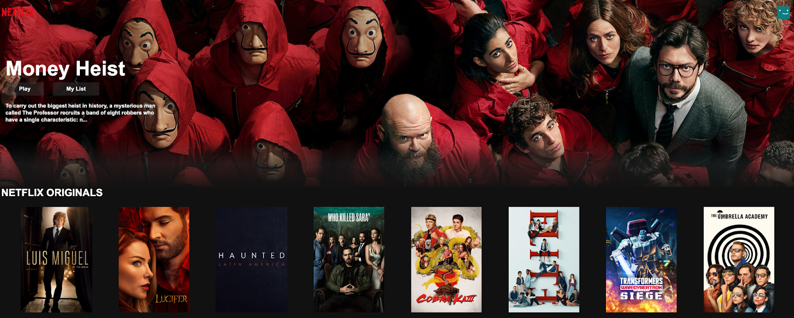
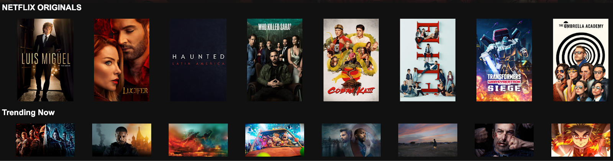

> 👉 [배포 페이지 바로가기](https://sj70.github.io/netflix_main_page/)

# 01. HTML, CSS를 이용해서 넷플릭스 사이트 만들기

### 수행기간

● 3일

---

### 결과물

● 제출해야 하는 결과물은 아래와 같습니다.

● 아래 링크의 (그림 1)의 리소스 형상(manifest)이 올라간 결과물 레포 주소 (URL 제출)

● (그림 1)은 참고용으로, 이미지와 폰트는 자유롭게 사용하시기 바랍니다.

---

### 하위과제

● Flex Box 또는 Grid CSS 를 이용해서 영화를 나열합니다.

● 영화에 마우스로 호버 하면 영화 이미지의 사이지가 크게 될 수 있게 합니다.
